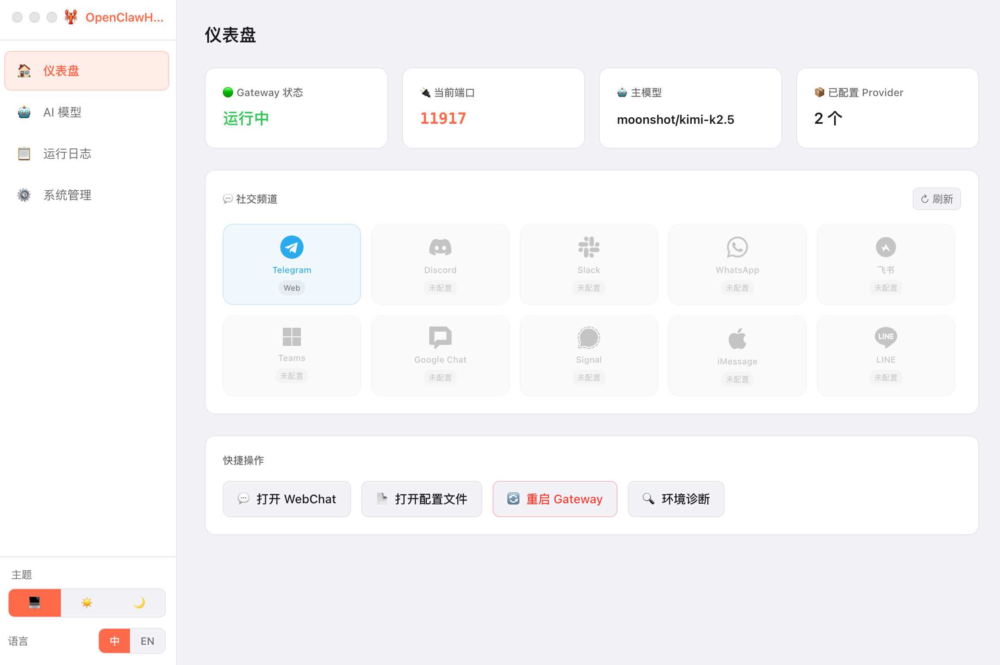
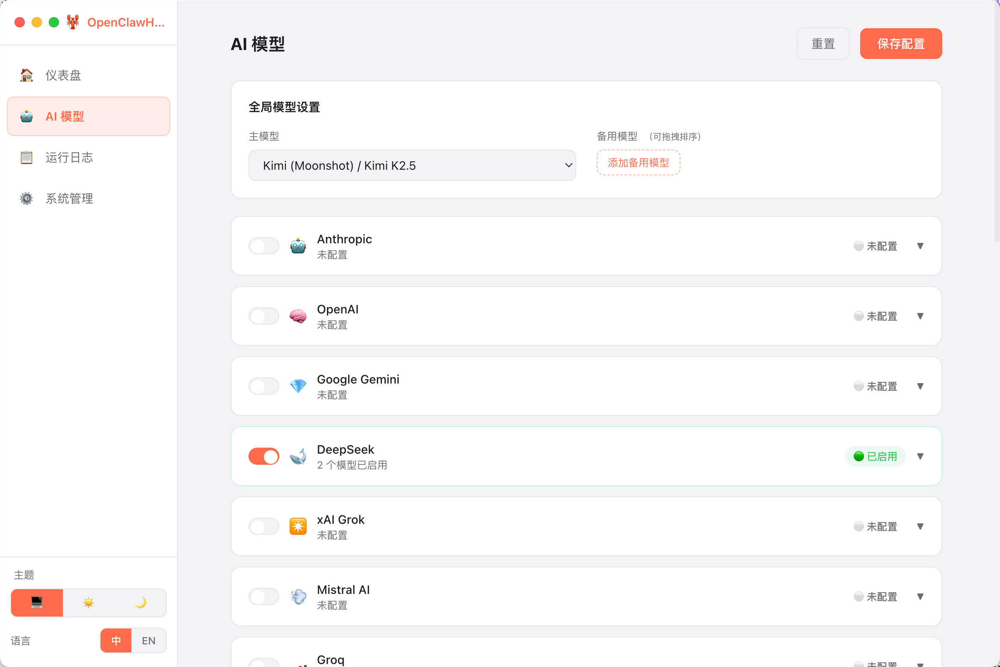
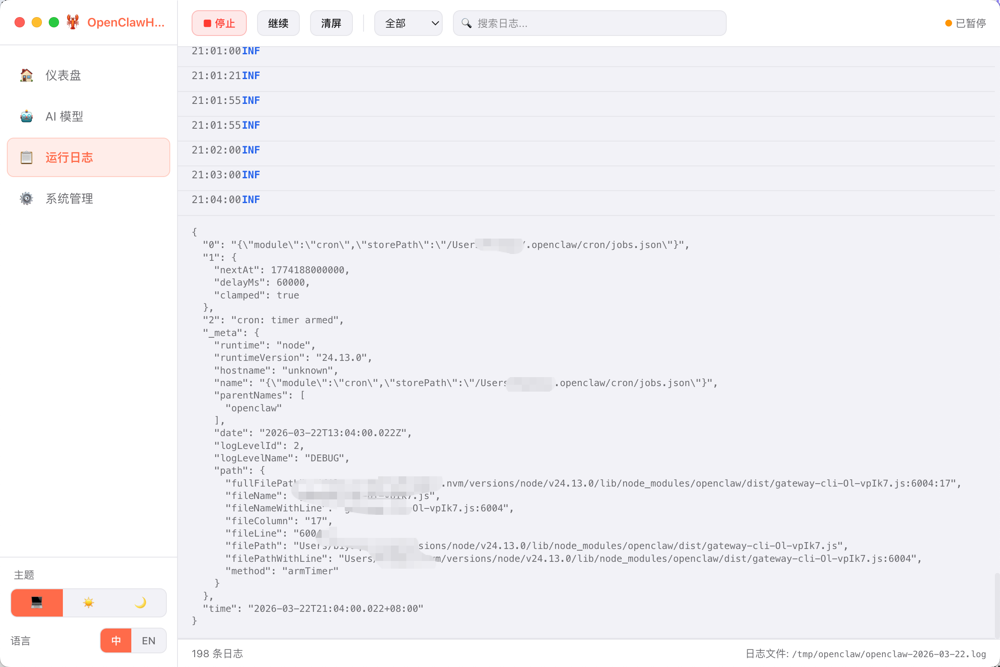
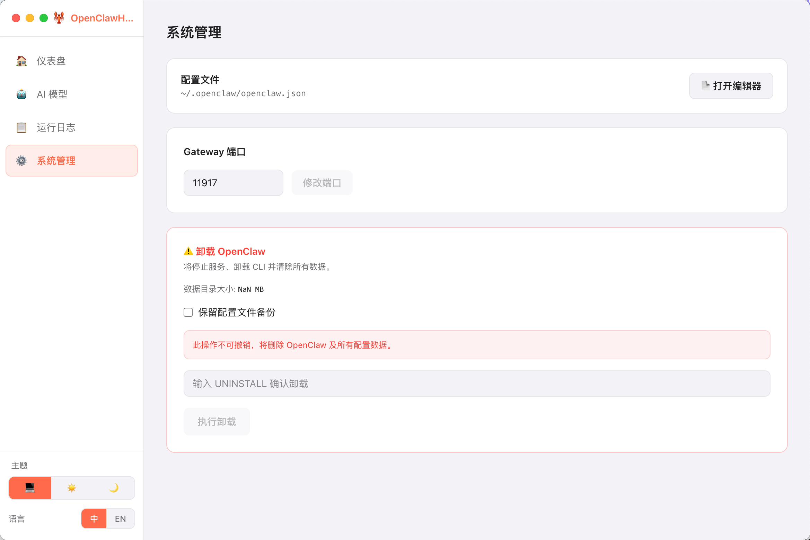

<div align="center">
  
  <h1>OpenClawHelper</h1>
  <p><strong>OpenClaw AI Gateway 可视化配置工具</strong></p>
  <p>
    
    
    
  </p>
  <p><a href="README.en.md">English</a></p>
</div>

---

## 简介

OpenClawHelper 是 [OpenClaw](https://openclaw.ai) AI Gateway 的桌面配置工具。无需手动编辑 JSON，通过图形界面即可管理 AI 模型提供商、切换主模型与备用模型、实时查看运行日志，让 AI 网关的配置和维护更高效。

---

## 截图

<table>
  <tr>
    <td align="center">
      <br/>
      <sub>仪表盘</sub>
    </td>
    <td align="center">
      <br/>
      <sub>AI 模型配置</sub>
    </td>
  </tr>
  <tr>
    <td align="center">
      <br/>
      <sub>实时日志</sub>
    </td>
    <td align="center">
      <br/>
      <sub>系统管理</sub>
    </td>
  </tr>
</table>

---

## 功能特性

**🤖 多平台 AI 模型管理**
- 支持 22+ 主流 AI 提供商：Anthropic、OpenAI、Google Gemini、DeepSeek、xAI Grok、Mistral、通义千问、智谱GLM、豆包、文心一言、Kimi 等
- 一键配置主模型与备用模型，支持故障自动切换
- 可视化启用 / 禁用任意 Provider 和模型

**📊 实时状态监控**
- 仪表盘展示 Gateway 运行状态、当前端口、主模型、已配置 Provider 数量
- 一键重启 / 启动 / 停止 Gateway

**💬 社交频道快捷入口**
- 自动检测已配置的社交渠道（Telegram、Discord、Slack、飞书、WhatsApp 等 10 个平台）
- 自动判断是否安装桌面端，优先打开 App，未安装则跳转 Web

**📋 实时日志**
- 流式接收 Gateway 运行日志，支持按级别（trace / debug / info / warn / error / fatal）过滤
- 关键词搜索、子系统筛选、虚拟滚动（10,000 条不卡顿）

**⚙️ 配置管理**
- 内置 JSON 编辑器（CodeMirror），直接编辑原始配置文件
- 所有修改安全合并，不破坏自定义字段

**🎨 主题与语言**
- 支持深色 / 浅色 / 跟随系统三种主题模式
- 中英文界面切换

---

## 系统要求

| | 版本 |
|---|---|
| macOS | 12 Monterey 及以上 |
| Windows | Windows 10 及以上 |
| OpenClaw | 需提前安装并启动 |

---

## 安装 OpenClaw

使用 OpenClawHelper 前，请先完成 OpenClaw 的安装与启动。

- 📖 **官方文档**：[docs.openclaw.ai](https://docs.openclaw.ai)
- 🌐 **官网**：[openclaw.ai](https://openclaw.ai)

---

## 下载安装

前往 [Releases](../../releases) 页面下载对应平台的安装包：

| 平台 | 文件 |
|---|---|
| macOS Apple Silicon | `OpenClawHelper-x.x.x-arm64.dmg` |
| macOS Intel | `OpenClawHelper-x.x.x.dmg` |
| Windows | `OpenClawHelper-x.x.x-Setup.exe` |

> **macOS 提示**：首次打开如提示「无法验证开发者」，前往「系统设置 → 隐私与安全性」点击「仍要打开」即可。

---

## 本地开发

```bash
# 克隆仓库
git clone https://github.com/your-org/openclaw-configurator.git
cd openclaw-configurator

# 安装依赖
npm install

# 启动开发模式
npm run dev

# 打包
npm run build:mac    # macOS
npm run build:win    # Windows
```

---

## 支持的 AI 提供商

| 类型 | 提供商 |
|---|---|
| 国际 | Anthropic · OpenAI · Google Gemini · DeepSeek · xAI Grok · Mistral AI · Groq · Together AI · Perplexity · Cohere · Fireworks AI · OpenRouter |
| 国内 | 通义千问 · 智谱GLM · 豆包 · 文心一言 · Kimi · 阶跃星辰 · 硅基流动 · 零一万物 · 小米MiMo · MiniMax |

---

## License

MIT © OpenClawHelper Contributors
